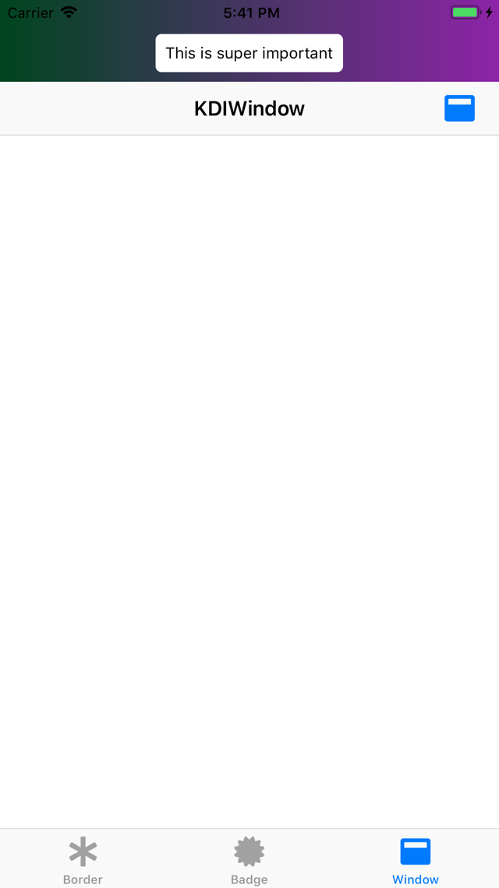
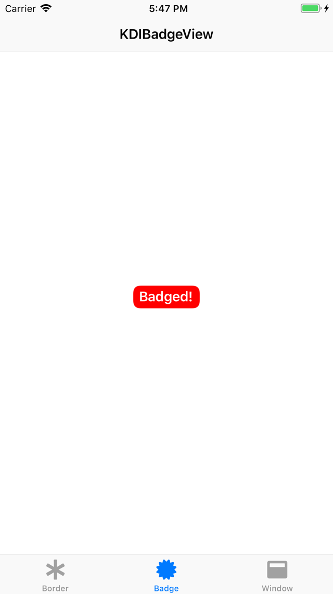
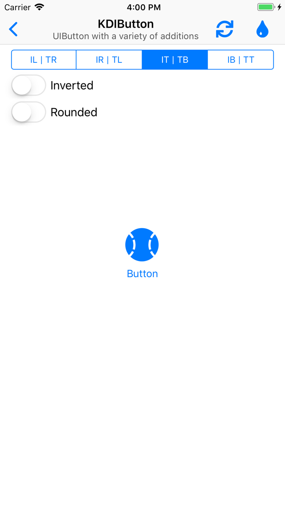

# Ditko

This is the next entry in a series of posts covering the various open source frameworks available on [Kosoku's GitHub](https://github.com/Kosoku).

This post will finish covering [Ditko](https://github.com/Kosoku/Ditko), a UI-centric framework available on iOS, tvOS, watchOS, and macOS. We will cover the classes available in the framework.

The Xcode project that was used to generate the images in this post is also available on [Kosoku's GitHub](https://github.com/Kosoku/kosoku-blog-posts/tree/master/Ditko/Kosoku-Blog-Ditko).

## Classes

### KDIWindow

*KDIWindow.h* is a `UIWindow` subclass that allows for an accessory view to be placed at the top or bottom edge of the window, similar to the in call bar on iPhone. For example:

```objc
#import <Ditko/Ditko.h>

// assume this exists
UIView *view = ...;
// from the root view controller of the application
KDIWindow *window = ...;

// by default the window will layout the accessory view at the top edge
window.accessoryView = view;
```

You get something that looks like this:



### KDIBadgeView

*KDIBadgeView.h* is a `UIView` subclass that draws a badge, similar to the system badging of tab bar items. It is very customizable, provides properties to change the foreground and background colors in normal and highlighted state as well as font, edge insets, and corner radius. For example:

```objc
#import <Ditko/Ditko.h>

KDIBadgeView *view = [[KDIBadgeView alloc] initWithFrame:CGRectZero];

// configure the badge view to draw like the system white on red badges
view.badgeForegroundColor = UIColor.whiteColor;
view.badgeBackgroundColor = UIColor.redColor;
view.badge = @"Badged!";
```

You get something that looks like this:



### KDIButton

*KDIButton.h* is a `UIButton` subclass that provides a variety of additional methods, including setting different alignments for image and title. For example, you could set image to be top alignment and centered horizontally, while setting the title to be bottom aligned and centered horizontally. Something like this:

```objc
#import <Ditko/Ditko.h>

KDIButton *button = [KDIButton buttonWithType:UIButtonTypeSystem];
// assume this exists
UIImage *image = ...;

button.titleContentVerticalAlignment = KDIButtonContentVerticalAlignmentBottom;
button.titleContentHorizontalAlignment = KDIButtonContentHorizontalAlignmentCenter;
button.imageContentVerticalAlignment = KDIButtonContentVerticalAlignmentTop;
button.imageContentHorizontalAlignment = KDIButtonContentHorizontalAlignmentCenter;
[button setImage:image forState:UIControlStateNormal];
[button setTitle:@"Title" forState:UIControlStateNormal];
```

You get a button that looks like this:

