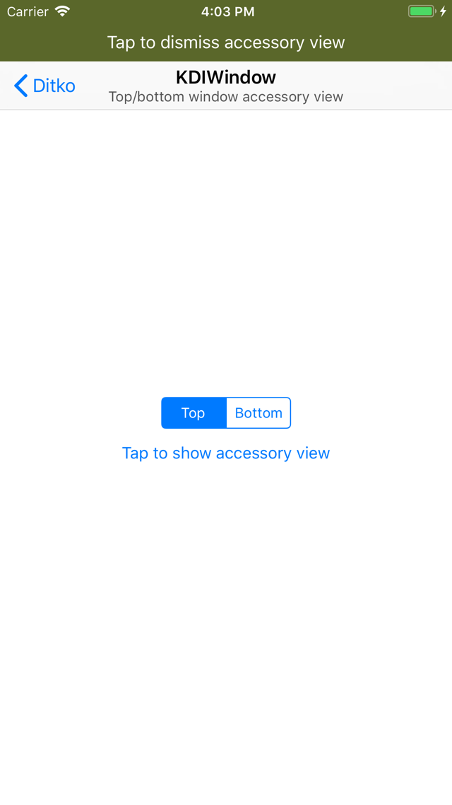
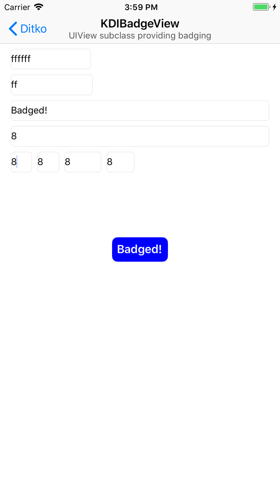
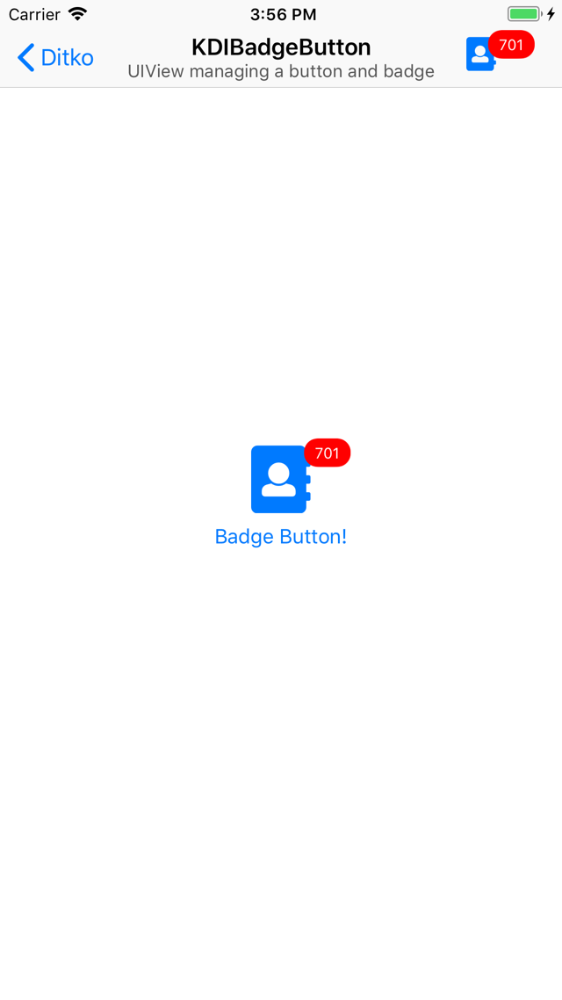

# Ditko

This is the next entry in a series of posts covering the various open source frameworks available on [Kosoku's GitHub](https://github.com/Kosoku).

This post will finish covering [Ditko](https://github.com/Kosoku/Ditko), a UI-centric framework available on iOS, tvOS, watchOS, and macOS. We will cover the classes available in the framework.

The Xcode project that was used to generate the images in this post is also available on [Kosoku's GitHub](https://github.com/Kosoku/kosoku-blog-posts/tree/master/Ditko/Kosoku-Blog-Ditko).

## KDIWindow

*KDIWindow.h* is a `UIWindow` subclass that allows for an accessory view to be placed at the top or bottom edge of the window, similar to the in call bar on iPhone. For example:

```objc
#import <Ditko/Ditko.h>

// assume this exists
UIView *view = ...;
// from the root view controller of the application
KDIWindow *window = ...;

// by default the window will layout the accessory view at the top edge
window.accessoryView = view;
```

You get something that looks like this:



## KDIBadgeView

*KDIBadgeView.h* is a `UIView` subclass that draws a badge, similar to the system badging of tab bar items. It is very customizable, provides properties to change the foreground and background colors in normal and highlighted state as well as font, edge insets, and corner radius. For example:

```objc
#import <Ditko/Ditko.h>

KDIBadgeView *view = [[KDIBadgeView alloc] initWithFrame:CGRectZero];

// configure the badge view to draw like the system white on red badges
view.badgeForegroundColor = UIColor.whiteColor;
view.badgeBackgroundColor = UIColor.redColor;
view.badge = @"Badged!";
```

You get something that looks like this:



## KDIButton

*KDIButton.h* is a `UIButton` subclass that provides a variety of additional methods, including setting different alignments for image and title. For example, you could set image to be top alignment and centered horizontally, while setting the title to be bottom aligned and centered horizontally. Something like this:

```objc
#import <Ditko/Ditko.h>

KDIButton *button = [KDIButton buttonWithType:UIButtonTypeSystem];
// assume this exists
UIImage *image = ...;

button.titleContentVerticalAlignment = KDIButtonContentVerticalAlignmentBottom;
button.titleContentHorizontalAlignment = KDIButtonContentHorizontalAlignmentCenter;
button.imageContentVerticalAlignment = KDIButtonContentVerticalAlignmentTop;
button.imageContentHorizontalAlignment = KDIButtonContentHorizontalAlignmentCenter;
[button setImage:image forState:UIControlStateNormal];
[button setTitle:@"Title" forState:UIControlStateNormal];
```

You get a button that looks like this:


## KDIBadgeButton

*KDIBadgeButton.h* is a `UIView` subclass that manages an instance of `KDIButton` and `KDIBadgeView` to allow for badging of system elements similar to `UITabBarItem`. For example:

```objc
#import <Ditko/Ditko.h>

KDIBadgeButton *badgeButton = [[KDIBadgeButton alloc] initWithFrame:CGRectZero];
// assume this exists
UIImage *image = ...;

badgeButton.badgePosition = KDIBadgeButtonBadgePositionRelativeToImage;
badgeButton.badgeView.badge = @"64";
badgeButton.button.imageContentVerticalAlignment = KDIButtonContentVerticalAlignmentTop;
badgeButton.button.imageContentHorizontalAlignment = KDIButtonContentHorizontalAlignmentCenter;
badgeButton.button.titleContentVerticalAlignment = KDIButtonContentVerticalAlignmentBottom;
badgeButton.button.titleContentHorizontalAlignment = KDIButtonContentHorizontalAlignmentCenter;
[badgeButton.button setImage:image forState:UIControlStateNormal];
[badgeButton.button setTitle:@"Badge Button!" forState:UIControlStateNormal];
```

You would get a view that looks like this:



## KDIEmptyView

*KDIEmptyView.h* is a `UIView` subclass that can be used to provide information to the user when content for a view is empty or unavailable. For example, you want to show the user's photos but require their permission first, this view could prompt the user to approve the system permission alert or prompt them to approve the permission in Settings if it was denied the first time. Sensible defaults are provided for font, color and spacing. For example:

```objc
#import <Ditko/Ditko.h>

KDIEmptyView *view = [[KDIEmptyView alloc] initWithFrame:CGRectZero];
// assume this exists
UIImage *image = ...;

view.image = image;
view.headline = @"Empty Headline";
view.body = @"Empty body text";
view.action = @"Toggle activity indicator";
```

You get a view that looks like this:


## KDIGradientView

*KDIGradientView.h* is a `UIView` subclass that uses `CAGradientLayer` as its backing layer to draw a gradient. For example:

```objc
#import <Ditko/Ditko.h>

KDIGradientView *gradientView = [[KDIGradientView alloc] initWithFrame:CGRectZero];

gradientView.colors = @[KDIColorRandomHSB(),
                             KDIColorRandomHSB(),
                             KDIColorRandomHSB()];
gradientView.startPoint = CGPointMake(0, 0);
gradientView.endPoint = CGPointMake(1, 1);
```

You get a view that looks like this:

