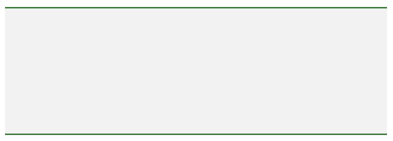

# Ditko

Welcome back for the next post in a series highlighting the various frameworks available on [Kosoku's GitHub](https://github.com/Kosoku).

Next up is [Ditko](https://github.com/Kosoku/Ditko), a UI-centric framework available on iOS, tvOS, watchOS, and macOS. This post will cover some of the more useful facilities provided by the framework along with examples.

## Macros

*KDIColorMacros.h* provides platform specific macros to create colors in various color spaces. For example:

```objc
// creates a color with the provided RGB components
UIColor *color = KDIColorRGB(0.2,0.5,1.0);
// creates a color from the hex string, including the leading @"#" character is optional
UIColor *colorFromHex = KDIColorHexadecimal(@"#abcd");
```

## Functions

*KDIFunctions.h* provides functions to scale a `CGSize` based on the scale factor of the main screen. For example:

```objc
// this would be (50,50) on a retina display and (75,75) on a 3x display (e.g. iPad Pro)
CGSize size = KDICGSizeAdjustedForMainScreenScale(CGSizeMake(25,25));
```

## Protocols

*KDIBorderedView.h* is a protocol adopted by a number of views within **Ditko** that allows the view to draw borders with varying options. For example, using `KDIView`, which conforms to `KDIBorderedView`, you could do the following:

```objc
// assume borderView is a property defined on self
self.borderView = [[KDIView alloc] initWithFrame:CGRectZero];

self.borderView.backgroundColor = KDIColorW(0.95);
    
self.borderView.borderOptions = KDIBorderOptionsTopAndBottom;
self.borderView.borderWidth = 4.0;
self.borderView.borderColor = KDIColorRandomRGB();

[self.view addSubview:self.borderView];

// setup your auto layout constraints
```

You would get something that looks like this:



## Categories

*UIColor+KDIExtensions.h* and *NSColor+KDIExtensions.h* provide methods to create and manipulate colors. You can create random RGB and HSB colors, create colors from hexadecimal strings, and create colors by adjusting the hue, saturation, or balance of an existing color. For example:

```objc
// creates a random RGB color
UIColor *randomRGB = UIColor.KDI_colorRandomRGB;
// creates a random HSB color
UIColor *randomHSB = UIColor.KDI_colorRandomHSB;
// creates a color from a hexadecimal string, the leading @"#" is optional
UIColor *colorFromHex = [UIColor KDI_colorWithHexadecimalString:@"#abcd"];
// this will be @"#abcd"
NSString *hexFromColor = [colorFromHex KDI_hexadecimalString];
// will be either white or black, whichever is more readable
UIColor *contrastColor = [colorFromHex KDI_contrastingColor];
// creates a color that is 10 percent brighter than randomRGB
UIColor *brightColor = [randomRGB KDI_colorByAdjustingBrightnessByPercent:0.1];
```

*UIImage+KDIExtensions.h* and *NSImage+KDIExtensions.h* provide methods to quickly switch between original and template images, and determine the dominant color of an image. For example:

```objc
// assume this exists
UIImage *image = ...;
// this will be a template image
UIImage *templateImage = image.KDI_templateImage;
// the dominant color of image, use with the methods above to determine which colors are most readable when layered on top the image
UIColor *color = [image KDI_dominantColor];
```

*UIBarButtonItem+KDIExtensions.h* provides methods to create some commonly used bar button items as well as attach blocks to bar button items instead of the normal target/action pattern. For example:

```objc
// need Stanley for the weakify/strongify macros
#import <Stanley/Stanley.h>

weakify(self);
UIBarButtonItem *addItem = [UIBarButtonItem KDI_barButtonSystemItem:UIBarButtonSystemItemAdd style:UIBarButtonItemStylePlain block:^(__kindof UIBarButtonItem *barButtonItem){
	strongify(self);
	// this block is invoked whenever the bar button item is tapped
	[self foo];
}];

// you can also set the block property on any created UIBarButtonItem, doing so will override its target/action
addItem.KDI_block = ^(__kindof UIBarButtonItem *barButtonItem) {
	strongify(self);
	[self bar];
};
```

*UIControl+KDIExtensions.h* and *NSControl+KDIExtensions.h* provide methods to attach blocks in addition to the normal target/action pattern. For example, on iOS:

```objc
// need Stanley for the weakify/strongify macros
#import <Stanley/Stanley.h>

// assume this exists, UIButton is a subclass of UIControl
UIButton *button = ...;

weakify(self);
[button KDI_addBlock:^(__kindof UIControl *control, UIControlEvents controlEvents){
	strongify(self);
	// this block will be invoked whenever the specified control events take place
	[self foo];
} forControlEvents:UIControlEventTouchUpInside];
```

Similarly, on macOS:

```objc
// need Stanley for the weakify/strongify macros
#import <Stanley/Stanley.h>

// assume this exists, NSButton is a subclass of NSControl
NSButton *button = ...;

weakify(self);
button.KDI_block = ^(__kindof NSControl *control) {
	strongify(self);
	// this block will be invoked whenever the control action is triggered
	[self bar];
};
```