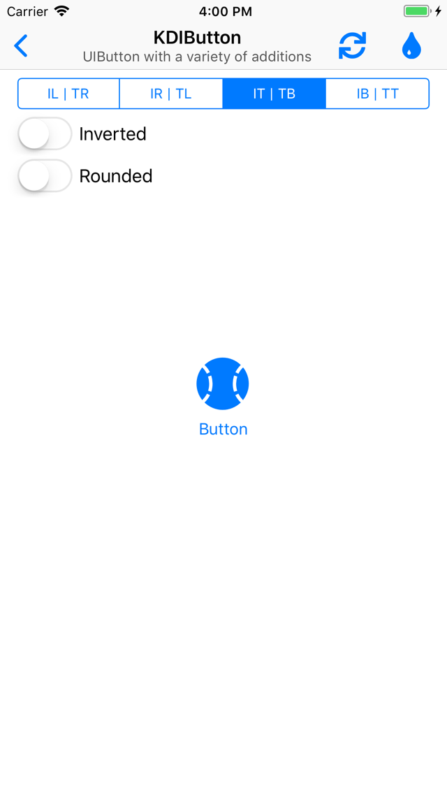
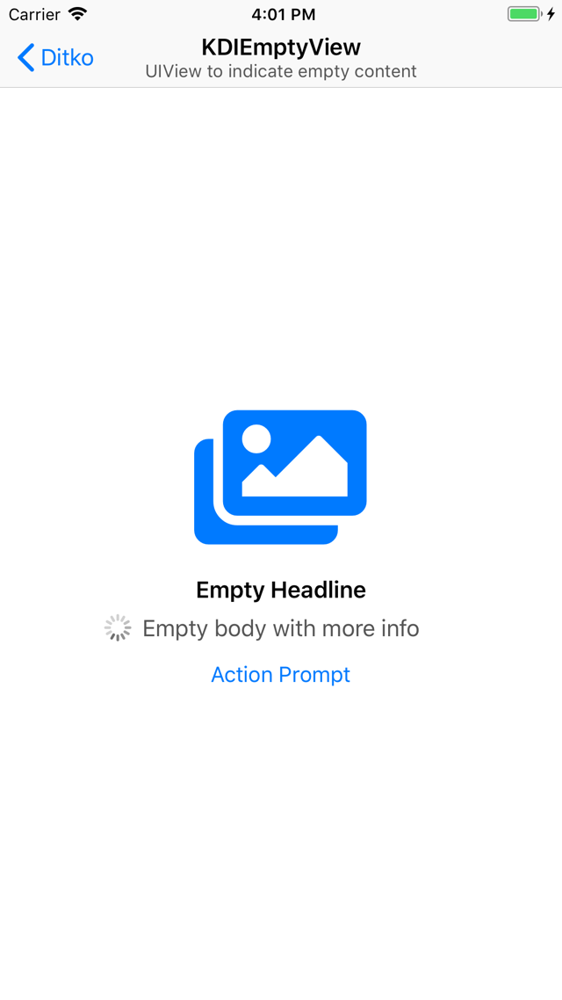
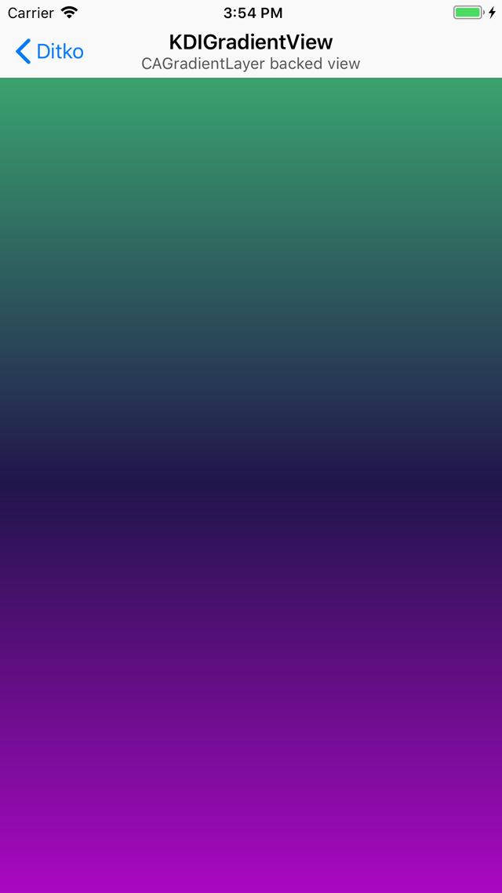
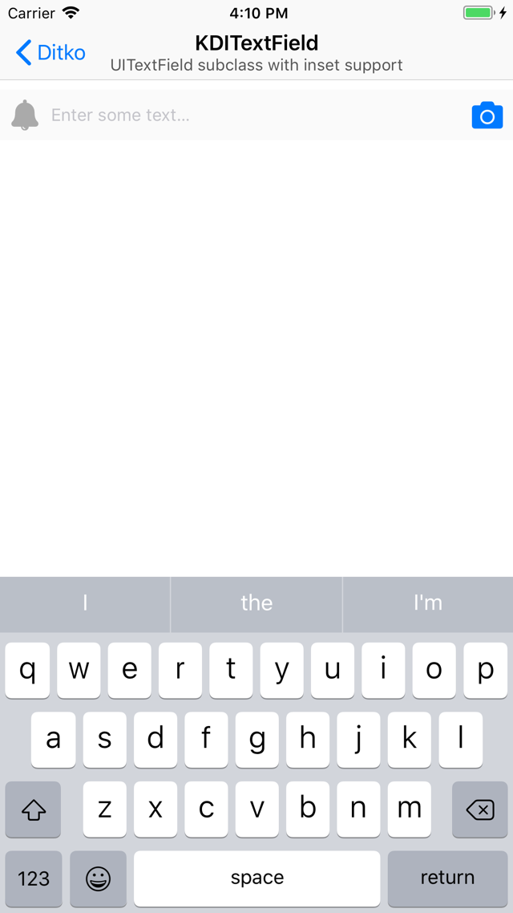
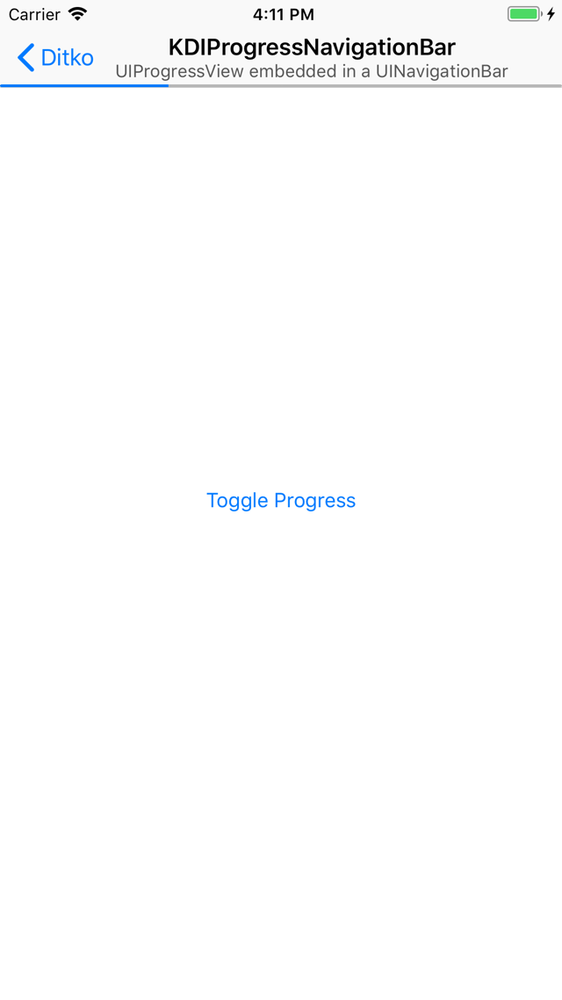
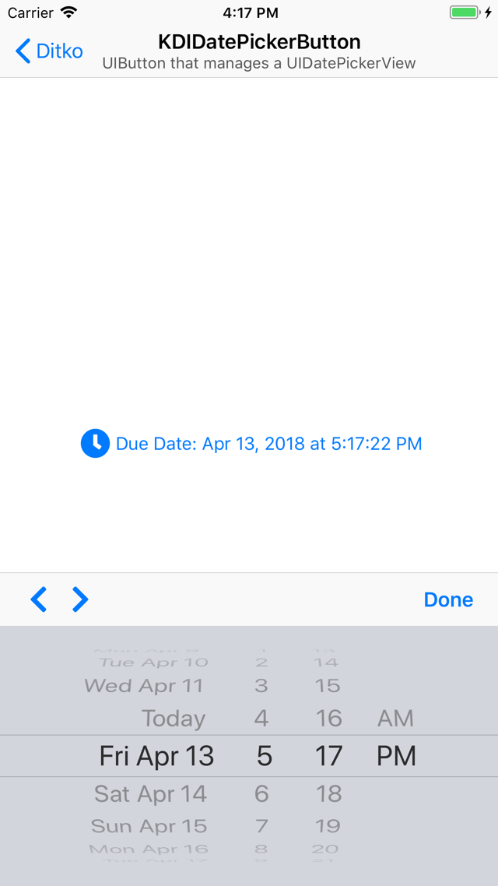
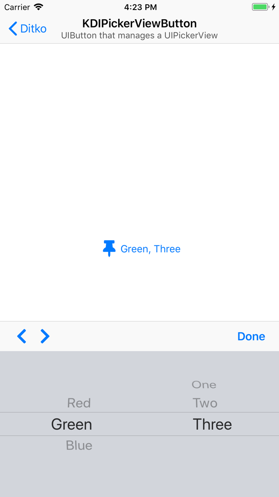
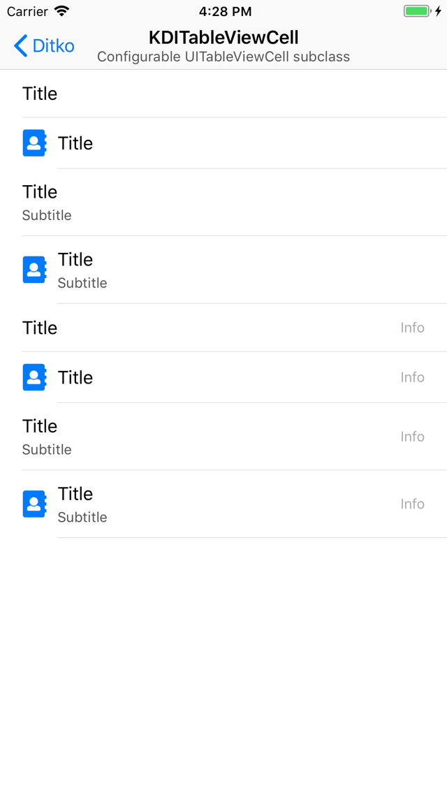
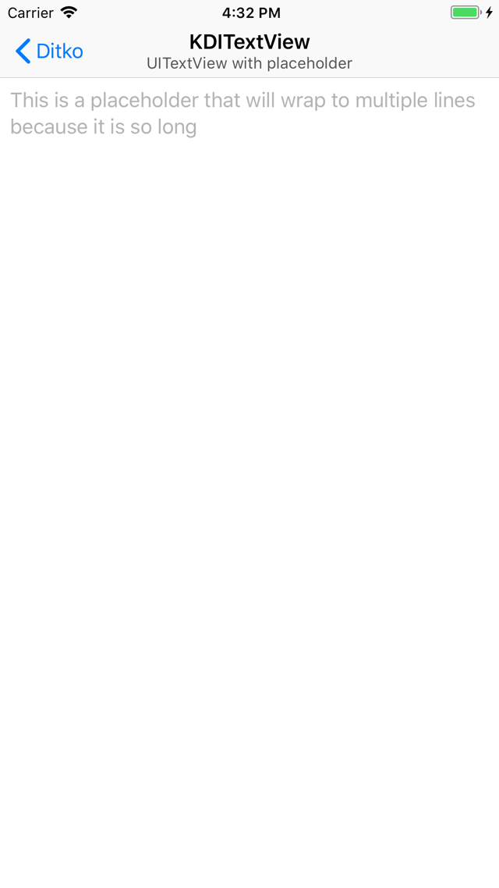
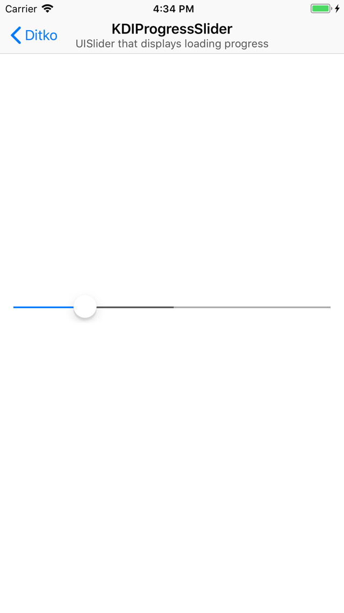

# Ditko

This is the next entry in a series of posts covering the various open source frameworks available on [Kosoku's GitHub](https://github.com/Kosoku).

This post will finish covering [Ditko](https://github.com/Kosoku/Ditko), a UI-centric framework available on iOS, tvOS, watchOS, and macOS. We will cover the classes available in the framework.

All of the images in this post were generated using the *Demo-iOS* target in the [Ditko](https://github.com/Kosoku/Ditko) repo.

## KDIWindow

*KDIWindow.h* is a `UIWindow` subclass that allows for an accessory view to be placed at the top or bottom edge of the window, similar to the in call bar on iPhone. For example:

```objc
#import <Ditko/Ditko.h>

// assume this exists
UIView *view = ...;
// from the root view controller of the application
KDIWindow *window = ...;

// by default the window will layout the accessory view at the top edge
window.accessoryView = view;
```

You get something that looks like this:


## KDIBadgeView

*KDIBadgeView.h* is a `UIView` subclass that draws a badge, similar to the system badging of tab bar items. It is very customizable, provides properties to change the foreground and background colors in normal and highlighted state as well as font, edge insets, and corner radius. For example:

```objc
#import <Ditko/Ditko.h>

KDIBadgeView *view = [[KDIBadgeView alloc] initWithFrame:CGRectZero];

// configure the badge view to draw like the system white on red badges
view.badgeForegroundColor = UIColor.whiteColor;
view.badgeBackgroundColor = UIColor.redColor;
view.badge = @"Badged!";
```

You get something that looks like this:


## KDIButton

*KDIButton.h* is a `UIButton` subclass that provides a variety of additional methods, including setting different alignments for image and title. For example, you could set image to be top alignment and centered horizontally, while setting the title to be bottom aligned and centered horizontally. Something like this:

```objc
#import <Ditko/Ditko.h>

KDIButton *button = [KDIButton buttonWithType:UIButtonTypeSystem];
// assume this exists
UIImage *image = ...;

button.titleContentVerticalAlignment = KDIButtonContentVerticalAlignmentBottom;
button.titleContentHorizontalAlignment = KDIButtonContentHorizontalAlignmentCenter;
button.imageContentVerticalAlignment = KDIButtonContentVerticalAlignmentTop;
button.imageContentHorizontalAlignment = KDIButtonContentHorizontalAlignmentCenter;
[button setImage:image forState:UIControlStateNormal];
[button setTitle:@"Title" forState:UIControlStateNormal];
```

You get a button that looks like this:



## KDIBadgeButton

*KDIBadgeButton.h* is a `UIView` subclass that manages an instance of `KDIButton` and `KDIBadgeView` to allow for badging of system elements similar to `UITabBarItem`. For example:

```objc
#import <Ditko/Ditko.h>

KDIBadgeButton *badgeButton = [[KDIBadgeButton alloc] initWithFrame:CGRectZero];
// assume this exists
UIImage *image = ...;

badgeButton.badgePosition = KDIBadgeButtonBadgePositionRelativeToImage;
badgeButton.badgeView.badge = @"64";
badgeButton.button.imageContentVerticalAlignment = KDIButtonContentVerticalAlignmentTop;
badgeButton.button.imageContentHorizontalAlignment = KDIButtonContentHorizontalAlignmentCenter;
badgeButton.button.titleContentVerticalAlignment = KDIButtonContentVerticalAlignmentBottom;
badgeButton.button.titleContentHorizontalAlignment = KDIButtonContentHorizontalAlignmentCenter;
[badgeButton.button setImage:image forState:UIControlStateNormal];
[badgeButton.button setTitle:@"Badge Button!" forState:UIControlStateNormal];
```

You would get a view that looks like this:


## KDIEmptyView

*KDIEmptyView.h* is a `UIView` subclass that can be used to provide information to the user when content for a view is empty or unavailable. For example, you want to show the user's photos but require their permission first, this view could prompt the user to approve the system permission alert or prompt them to approve the permission in Settings if it was denied the first time. Sensible defaults are provided for font, color and spacing. For example:

```objc
#import <Ditko/Ditko.h>

KDIEmptyView *view = [[KDIEmptyView alloc] initWithFrame:CGRectZero];
// assume this exists
UIImage *image = ...;

view.image = image;
view.headline = @"Empty Headline";
view.body = @"Empty body text";
view.action = @"Toggle activity indicator";
```

You get a view that looks like this:



## KDIGradientView

*KDIGradientView.h* is a `UIView` subclass that uses `CAGradientLayer` as its backing layer to draw a gradient. For example:

```objc
#import <Ditko/Ditko.h>

KDIGradientView *gradientView = [[KDIGradientView alloc] initWithFrame:CGRectZero];

gradientView.colors = @[KDIColorRandomHSB(),
                             KDIColorRandomHSB(),
                             KDIColorRandomHSB()];
gradientView.startPoint = CGPointMake(0, 0);
gradientView.endPoint = CGPointMake(1, 1);
```

You get a view that looks like this:



## KDITextField

*KDITextField.h* is a `UITextField` subclass that provides inset support for the text, left, and right views. For example:

```objc
#import <Ditko/Ditko.h>

CGFloat kSubviewMargin = 8.0;
// assume textField is a property defined on self
self.textField = [[KDITextField alloc] initWithFrame:CGRectZero];
self.textField.textEdgeInsets = UIEdgeInsetsMake(kSubviewMargin, kSubviewMargin, kSubviewMargin, kSubviewMargin);
self.textField.leftViewEdgeInsets = UIEdgeInsetsMake(kSubviewMargin, kSubviewMargin, kSubviewMargin, 0);
self.textField.leftView = ({
    // assume this exists
    UIImage *leftImage = ...;
    UIImageView *retval = [[UIImageView alloc] initWithImage:leftImage];
    
    retval.tintColor = UIColor.lightGrayColor;
    
    retval;
});
self.textField.leftViewMode = UITextFieldViewModeAlways;
self.textField.rightViewEdgeInsets = UIEdgeInsetsMake(kSubviewMargin, 0, kSubviewMargin, kSubviewMargin);
self.textField.rightView = ({
    // assume this exists
    UIImage *rightImage = ...;
    UIButton *retval = [UIButton buttonWithType:UIButtonTypeSystem];
    
    [retval setImage:rightImage forState:UIControlStateNormal];
    [retval sizeToFit];
    
    retval;
});
self.textField.rightViewMode = UITextFieldViewModeAlways;
```

You get a text field that looks like this:



## KDIProgressNavigationBar

*KDIProgressNavigationBar.h* is a `UINavigationBar` subclass that manages a `UIProgressView` instance you can message using category methods on `UINavigationController`. You must ensure the `UINavigationController` you are referencing is using `KDIProgressNavigationBar` as its navigation bar class using the `initWithNavigationBarClass:toolbarClass:` initializer method.

For example, inside your `UIViewController` subclass:

```objc
#import <Ditko/Ditko.h>

- (void)viewWillAppear:(BOOL)animated {
    [super viewWillAppear:animated];
    
    self.navigationController.KDI_progressNavigationBar.progress = 0.2;
    [self.navigationController.KDI_progressNavigationBar setProgressHidden:NO animated:animated];
}
```

Would look like this:



## KDIDatePickerButton

*KDIDatePickerButton.h* is a `KDIButton` subclass that manages a `UIDatePicker` as its `inputView`. It provides the same customization that `UIDatePicker` does as well as a few additions. For example:

```objc
#import <Ditko/Ditko.h>

// assume this exists
UIImage *image = ...;
// assume datePickerButton is a property defined on self
self.datePickerButton = [KDIDatePickerButton buttonWithType:UIButtonTypeSystem];
self.datePickerButton.titleEdgeInsets = UIEdgeInsetsMake(0, kSubviewMargin, 0, 0);
[self.datePickerButton setImage:image forState:UIControlStateNormal];
self.datePickerButton.dateTitleBlock = ^NSString * _Nullable(__kindof KDIDatePickerButton * _Nonnull datePickerButton, NSString * _Nonnull defaultTitle) {
    return [NSString stringWithFormat:@"Due Date: %@",defaultTitle];
};
```

You would get this:



## KDIPickerViewButton

*KDIPickerViewButton.h* is a `KDIButton` subclass that manages a `UIPickerView` as its `inputView`. It provides the same customization that `UIPickerView` does through its `KDIPickerViewButtonDataSource` and `KDIPickerViewButtonDelegate` protocols, as well as a few additions. For example:

```objc
- (void)viewDidLoad {
    [super viewDidLoad];
    
    // assume rowsAndComponents is a property defined on self
    self.rowsAndComponents = @[@[@"Red",@"Green",@"Blue"],
                               @[@"One",@"Two",@"Three"]];
    
    // assume this exists
    UIImage *image = ...;
    // assume pickerViewButton is an IBOutlet on self
    self.pickerViewButton.titleEdgeInsets = UIEdgeInsetsMake(0, kSubviewMargin, 0, 0);
    [self.pickerViewButton setImage:image forState:UIControlStateNormal];
    self.pickerViewButton.selectedComponentsJoinString = @", ";
    self.pickerViewButton.dataSource = self;
    self.pickerViewButton.delegate = self;
}

- (NSInteger)numberOfComponentsInPickerViewButton:(KDIPickerViewButton *)pickerViewButton {
    return self.rowsAndComponents.count;
}
- (NSInteger)pickerViewButton:(KDIPickerViewButton *)pickerViewButton numberOfRowsInComponent:(NSInteger)component {
    return self.rowsAndComponents[component].count;
}
- (NSString *)pickerViewButton:(KDIPickerViewButton *)pickerViewButton titleForRow:(NSInteger)row forComponent:(NSInteger)component {
    return self.rowsAndComponents[component][row];
}
```

You get this:



## KDITableViewCell

*KDITableViewCell.h* is a `UITableViewCell` subclass that supports a variety of commonly used configurations. It provides methods to customize its appearance. In its default state, it looks like this:



## KDITextView

*KDITextView.h* is a `UITextView` subclass that provides placeholder support along with min/max number of lines and height support. This is what it looks like with a multiple line placeholder set:



## KDIProgressSlider

*KDIProgressSlider.h* is a `UISlider` subclass that can display loading progress. For example a scrubber control used with a streaming video player. It's default configuration looks like this:



That does it for part 2 of the Ditko blog posts. Once again, you can find all the code behind the screen shots in this post in the [Ditko](https://github.com/Kosoku/Ditko) repo. Thanks for reading!